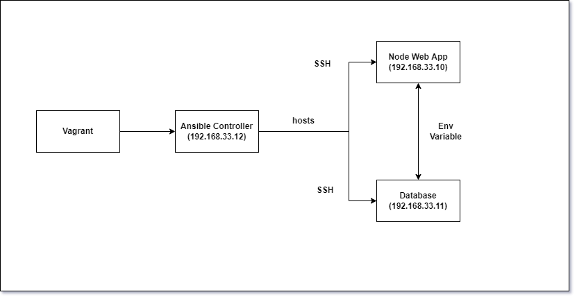

# Infrastructure as Code
- Allows us to codify everything to automate processes with config management
## IAC with Ansible
- Heavily used within industry
- IaC tool for configuration
- Ansible uses YAML to write playbooks (aka scripts)
### Why should we use Ansible?
- Simple
- Agentless
- Fast
- Dependencies include: Python
- Compatibility with Linux-like and Microsoft

## Configuration Management

- ssh into controller
- run update and upgrade commands to ensure it has internet
- repeat for web and db

`vagrant ssh controller`
`vagrant ssh web`
`vagrant ssh db`
```
sudo apt-get update -y
sudo apt-get upgrade -y
sudo apt-get install software-properties-common -y
sudo apt-add-repository ppa:ansible/ansible -y
sudo apt-get install ansible -y
ssh-keyscan -H 192.168.33.10 >> ~/.ssh/known_hosts
ssh-keyscan -H 192.168.33.11 >> ~/.ssh/known_hosts
sudo rm hosts
sudo nano hosts

```
# Connecting Vagrant controller with other instances
- Access to the hosts file
- May be worth deleting and writing new file rather than editing
`cd /etc/ansible`
`sudo nano hosts`

- Details to put into hosts file in controller
```
[web]
192.168.33.10 ansible_connection=ssh ansible_ssh_user=vagrant ansible_ssh_pass=vagrant
[db]
192.168.33.11 ansible_connection=ssh ansible_ssh_user=vagrant ansible_ssh_pass=vagrant
```
- Accessing other instances manually
`ssh vagrant@***IP_ADDRESS***`
- Pinging web app, database then everything in hosts
```
ansible web -m ping
ansible db -m ping
ansible all -m ping
```
- Executing command in all instances
`ansible all -a "SOME COMMAND"`
- e.g.
`ansible all -a "ls"`
### Types of Config Management
#### Push and Pull config Management?
#### Tools Available as IaC


### Let's create Vagrantfile to create Three VMs for Ansible architecture
#### Ansible controller and Ansible agents

- Vagrantfile Contents
```

# -*- mode: ruby -*-
 # vi: set ft=ruby :

 # All Vagrant configuration is done below. The "2" in Vagrant.configure
 # configures the configuration version (we support older styles for
 # backwards compatibility). Please don't change it unless you know what

 # MULTI SERVER/VMs environment
 #
 Vagrant.configure("2") do |config|
 # creating are Ansible controller
   config.vm.define "controller" do |controller|

    controller.vm.box = "bento/ubuntu-18.04"

    controller.vm.hostname = 'controller'

    controller.vm.network :private_network, ip: "192.168.33.12"

    # config.hostsupdater.aliases = ["development.controller"]

   end
 # creating first VM called web  
   config.vm.define "web" do |web|

     web.vm.box = "bento/ubuntu-18.04"
    # downloading ubuntu 18.04 image

     web.vm.hostname = 'web'
     # assigning host name to the VM

     web.vm.network :private_network, ip: "192.168.33.10"
     #   assigning private IP

     #config.hostsupdater.aliases = ["development.web"]
     # creating a link called development.web so we can access web page with this link instread of an IP   

   end

 # creating second VM called db
   config.vm.define "db" do |db|

     db.vm.box = "bento/ubuntu-18.04"

     db.vm.hostname = 'db'

     db.vm.network :private_network, ip: "192.168.33.11"

     #config.hostsupdater.aliases = ["development.db"]     
   end


 end
```
